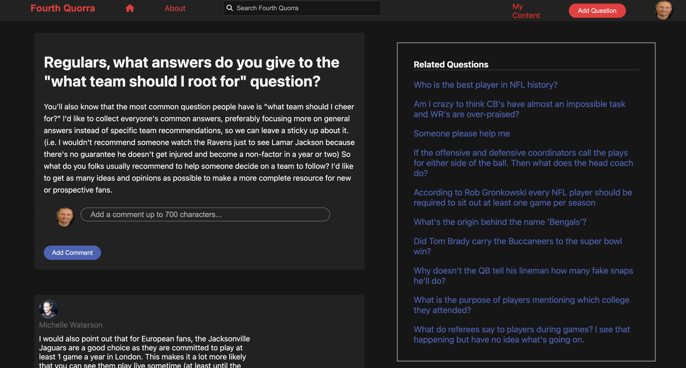
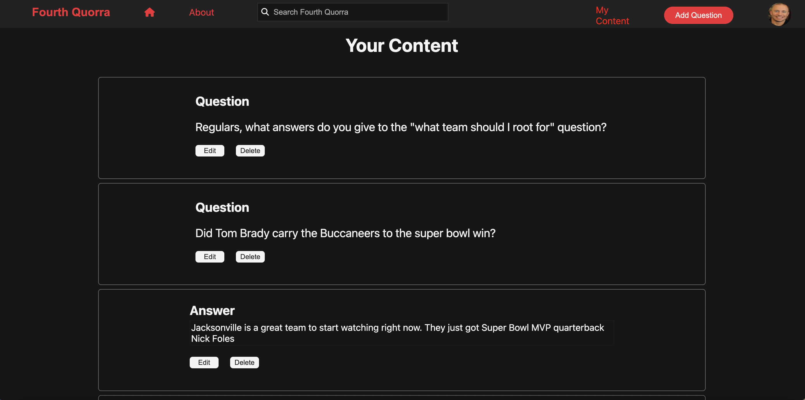

# Fourth Quorra

Fourth Quorra is a website clone of Quora. Quora is an online community to ask questions, share posts and interact with other users via a follow and upvote downvote system. This is the perfect site for those who enjoy scrollling and having an interactive feed with your interests. Fourth Quorra specializes in American Football related content.


# Wiki
Information about this project:
- [Feature List](https://github.com/Cal-Flores/Capstone/wiki/Features-List)

- [Database Schema](https://github.com/Cal-Flores/Capstone/wiki/DB-Schema)

- [User Stories](https://github.com/Cal-Flores/Capstone/wiki/User-Stories)


# Technologies used
 - [](https://flask.palletsprojects.com/en/2.2.x/)
 - [](https://reactjs.org/)
 - [](https://html.com/)
 - [](https://www.w3.org/Style/CSS/Overview.en.html)
 - [](https://www.postgresql.org/)
 - [](https://render.com/)


# Getting Started

1. Clone the repo
```
git clone https://github.com/Cal-Flores/Capstone.git
```

2. Install Packages
```
pipenv install
cd react-app
npm install
```

3. Create a .env file and set the environment variables for SECRET_KEY and DATABASE_URL to your choosing.

4. Migrate and seed the files.
```
flask run db init
flask run migrate
flask seed all
```
5. Run the server and start the react app
```
pipenv run flask run
cd react-app
npm start
```


# The App

The Home page of Fourth Quora displays to all users the questions from the database as well as use of the search bar. To interact with the questions you must be logged in. Once logged in you have access to all questions comments and the ability to view your activity on the platform such as questions and answers you have posted. Logged in users gain the ability to ask questions.
 


 When clicking on a question title in the home page you are redirected to the individual Questions page. On this page all answers belonging to the question are displayed. You may also create a question here to be posted for all logged in users to see. Related questions also appears here for users to navigate to.
 

Logged in users can view all thier activity including questions they have asked as well as Answers they have posted. This page allows users to edit and delete any content they have posted, as well as the ability to navigate to the questions that have been asked/answered.


<!-- The use of modals for logging in, signing up, creating and editing a question and answer are heavily utilized.

 -->
